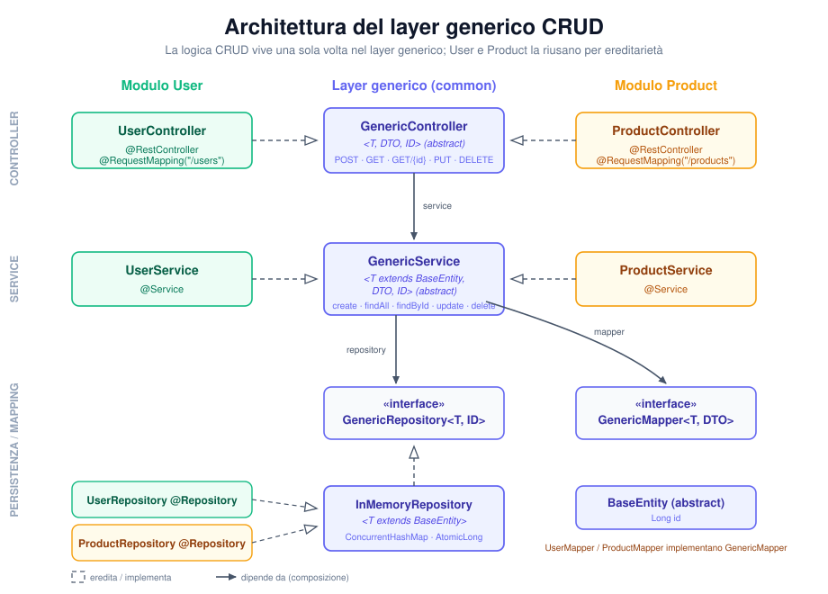

# CRUD REST API — User & Product

REST API back-end che espone operazioni CRUD su due entità (`User` e `Product`) riutilizzando
un'unica implementazione generica della logica CRUD. Persistenza **in-memory** (nessun database),
DTO in input/output e documentazione **Swagger**.

> Esercizio per il secondo colloquio. Il focus non è il CRUD in sé, ma **come ho progettato,
> astratto e organizzato il codice** per non duplicare la stessa logica tra entità diverse.



---

## Perché Java (e Spring Boot)

La posizione è su **C# / .NET** e la consegna lasciava libertà tra C#, Java, Kotlin e TypeScript.
Ho scelto **Java con Spring Boot** per due motivi concreti:

- **È il linguaggio principale del mio stack.** Lo uso quotidianamente con Spring Boot, quindi posso
  concentrare il tempo sul ragionamento di design (l'astrazione richiesta) invece che sulla sintassi.
- **Spring Boot è molto vicino a .NET come modello mentale.** Dependency injection, controller annotati,
  layering service/repository: i concetti si trasferiscono quasi 1:1 su ASP.NET Core, quindi le scelte
  fatte qui restano leggibili e valutabili anche per un team .NET.

Java e C# condividono un sistema di tipi simile, e proprio i **generics** sono il cuore della soluzione
di riuso: la stessa idea (`GenericController<T, DTO, ID>`) si tradurrebbe quasi identica in C#.

---

## Stack tecnico

| Componente | Versione / Scelta |
|---|---|
| Java | 17 |
| Spring Boot | 3.3.5 |
| Lombok | gestione boilerplate (getter/setter/builder) |
| SpringDoc OpenAPI | 2.6.0 (Swagger UI) |
| Persistenza | `ConcurrentHashMap` in-memory (thread-safe) |
| Test | JUnit 5 |

---

## Prerequisiti e avvio

Servono **JDK 17+** e **Maven 3.9+**.

```bash
# avvio in sviluppo
mvn spring-boot:run

# in alternativa: build del jar ed esecuzione
mvn clean package
java -jar target/crud-rest-api-1.0.0.jar
```

L'applicazione parte su `http://localhost:8080`.

### Swagger / OpenAPI

- **Swagger UI:** `http://localhost:8080/swagger-ui/index.html`
- **OpenAPI JSON:** `http://localhost:8080/v3/api-docs`

### Endpoint esposti

| Metodo | Path | Descrizione | Status OK |
|---|---|---|---|
| `POST` | `/users` · `/products` | Crea una risorsa | `201 Created` |
| `GET` | `/users` · `/products` | Lista paginata (`?page=0&size=20`) | `200 OK` |
| `GET` | `/users/{id}` · `/products/{id}` | Lettura singola | `200 OK` |
| `PUT` | `/users/{id}` · `/products/{id}` | Aggiorna una risorsa | `200 OK` |
| `DELETE` | `/users/{id}` · `/products/{id}` | Elimina una risorsa | `204 No Content` |

---

## Come ho impostato il riuso (il punto centrale)

Le due entità condividono esattamente le stesse cinque operazioni, quindi ho spostato quella logica
**una volta sola** in un layer generico nel package `common`, parametrizzato su tre tipi:

- **`T`** — il tipo dell'entità (vincolato a `T extends BaseEntity`, così il layer generico può leggere
  e impostare l'`id` senza sapere quale entità sia);
- **`DTO`** — il tipo del Data Transfer Object esposto dall'API;
- **`ID`** — il tipo della chiave (qui `Long`).

La catena è:

```
GenericController<T, DTO, ID>   →  riceve/risponde con DTO, delega tutto al service
        └── GenericService<T, DTO, ID>   →  orchestra mapping + persistenza, lancia 404
                └── GenericRepository<T, ID>   →  contratto di persistenza
                        └── InMemoryRepository<T>   →  ConcurrentHashMap + AtomicLong
```

`UserController`/`ProductController`, `UserService`/`ProductService`,
`UserRepository`/`ProductRepository` **non contengono logica CRUD**: estendono le classi generiche e
forniscono solo i tipi concreti (più, per il service, il `GenericMapper` specifico e il nome della
risorsa usato nei messaggi d'errore). Aggiungere un'entità significa quindi **collegare i pezzi**, non
riscrivere il CRUD.

I controller concreti restano classi vuote che estendono il generico: Spring risolve i tipi `T`/`DTO`
dal sottotipo concreto, quindi `@RequestBody DTO` e `@PathVariable ID` vengono deserializzati nel tipo
giusto a runtime.

---

## Cosa ho trovato difficile

Sono onesto: non è stato tutto liscio.

- **Far risolvere i generics a Spring nei controller.** All'inizio non ero sicuro che Spring riuscisse a
  deserializzare `@RequestBody DTO` partendo da un metodo dichiarato sulla superclasse generica. Ho
  dovuto verificare che, estendendo `GenericController<User, UserDto, Long>` con una classe concreta,
  Spring usasse il tipo reale (`UserDto`) e non `Object`. Funziona perché il tipo è "fissato" dal
  sottotipo, ma è il punto che mi ha fatto dubitare di più.
- **Dove mettere il mapping entità↔DTO.** Ho oscillato tra metterlo nel controller, nel service o in una
  classe dedicata. Alla fine l'ho isolato in un `GenericMapper<T, DTO>` iniettato nel service: tiene il
  controller "stupido" e rende il mapping testabile, ma ho dovuto scrivere i mapper a mano (vedi sotto).
- **Il vincolo `T extends BaseEntity`.** Mi ci è voluto un attimo per capire che, senza quel bound, il
  layer generico non poteva leggere/scrivere l'`id` in modo type-safe durante `create`/`update`.
- **Auto-increment generico.** Ho lasciato `InMemoryRepository` legato a `Long` con un `AtomicLong`
  perché la generazione dell'id dipende dalla strategia di persistenza concreta; tenerlo del tutto
  generico (`ID` qualsiasi) avrebbe complicato il codice senza un beneficio reale per questo esercizio.

---

## Cosa migliorerei avendo più tempo

- **MapStruct** al posto dei mapper scritti a mano: meno codice ripetitivo e mapping verificato a
  compile-time.
- **Database reale** (PostgreSQL + Spring Data JPA): `GenericRepository` è già il punto giusto dove
  sostituire l'implementazione in-memory con una `JpaRepository`, senza toccare service e controller.
- **Paginazione completa**: oggi pagino la lista in memoria con un `PageResponse` custom; con JPA
  passerei a `Pageable`/`Page` nativi, con ordinamento e total count gestiti dal DB.
- **Test più estesi**: ora copro il service; aggiungerei test di integrazione sui controller con
  `@WebMvcTest`/`MockMvc` e casi sui codici di errore.
- **Gestione dell'update parziale** (`PATCH`) oltre al `PUT` completo.

---

## Come aggiungere una nuova entità `Order`

Grazie al layer generico, una nuova entità richiede solo file di "collegamento", senza riscrivere il CRUD:

1. **Entità** — `Order extends BaseEntity` con i suoi campi (es. `customer`, `total`). L'`id` arriva
   dalla base.
2. **DTO** — `OrderDto` con le annotazioni di validazione (`@NotBlank`, `@NotNull`, `@Positive`, ...) e
   messaggi personalizzati.
3. **Mapper** — `OrderMapper implements GenericMapper<Order, OrderDto>` annotato `@Component`.
4. **Repository** — `OrderRepository extends InMemoryRepository<Order>` annotato `@Repository` (corpo vuoto).
5. **Service** — `OrderService extends GenericService<Order, OrderDto, Long>`, passa repository e mapper
   al costruttore della base e implementa `resourceName()` → `"Order"`.
6. **Controller** — `OrderController extends GenericController<Order, OrderDto, Long>` annotato
   `@RestController @RequestMapping("/orders")` (corpo vuoto).

Nessuna logica CRUD viene duplicata: i cinque endpoint di `/orders` funzionano automaticamente.

---

## Struttura del progetto

```
src/main/java/com/example/crudapi
├── CrudApiApplication.java          # entry point Spring Boot
├── common/                          # layer generico riusabile
│   ├── BaseEntity.java              # classe base con l'id
│   ├── GenericRepository.java       # contratto di persistenza <T, ID>
│   ├── InMemoryRepository.java      # impl. in-memory (ConcurrentHashMap + AtomicLong)
│   ├── GenericMapper.java           # contratto di mapping <T, DTO>
│   ├── GenericService.java          # logica CRUD astratta <T, DTO, ID>
│   ├── GenericController.java       # endpoint REST astratti <T, DTO, ID>
│   └── PageResponse.java            # wrapper di risposta paginata
├── user/                            # modulo User (solo collegamenti)
│   ├── User.java  UserDto.java  UserMapper.java
│   ├── UserRepository.java  UserService.java  UserController.java
├── product/                         # modulo Product (stesso schema)
│   ├── Product.java  ProductDto.java  ProductMapper.java
│   ├── ProductRepository.java  ProductService.java  ProductController.java
├── exception/
│   ├── ResourceNotFoundException.java
│   ├── ErrorResponse.java           # errore strutturato (timestamp, status, message, path)
│   └── GlobalExceptionHandler.java  # @RestControllerAdvice → 400 / 404 / 500
└── config/
    └── OpenApiConfig.java           # configurazione Swagger/OpenAPI
```

---

## Bonus implementati

- ✅ **Paginazione** sulla lettura della lista (`?page=&size=` → `PageResponse`)
- ✅ **Validazione input** (`@Valid` + `@NotBlank`/`@NotNull`/`@Positive` con messaggi personalizzati)
- ✅ **Gestione errori HTTP** strutturata (`400` validazione, `404` non trovato, `500` generico)
- ✅ **Test automatici** (`UserServiceTest`, JUnit 5)
- ✅ **Nota su come estendere** a una nuova entità (sezione sopra)
